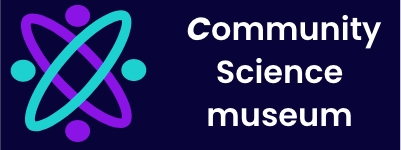

# The-Community-Science-Museum

A semester project called “community science museum” with 4 webpages

## Description

The Science museum website was a course assignment which was developed with HTML and CSS.

The following steps were used during development:

Adobe XD was use for designing the website.
The design was tested using Adobe XD prototype.
The website was created using HTML and CSS.

<a href="https://dreamy-curran-2df551.netlify.app ">Rainydays Link</a>

## Built With

HTML
CSS

## Designed with

AdobeXD

## Getting Started

### Installing

Download the zip of the project or clone the repo :

https://github.com/sayeda-chattopadhyay/The-Community-Science-Museum.git

### Running

Open in Visual Studio Code and use the Live Server Preview extension to view the site.

## Contributing

Any suggestions and feedback are welcome

## Contact

[My Gmail](mailto:sayeda.b@gmail.com)

[My LinkedIn page](https://www.linkedin.com/in/sayeda-chattopadhyay-7b33ba156/)

[My Behance page](https://www.behance.net/gallery/111339401/UX-Portfolio)

## License

Copyright (c) 2022 Sayeda Chattopadhyay
